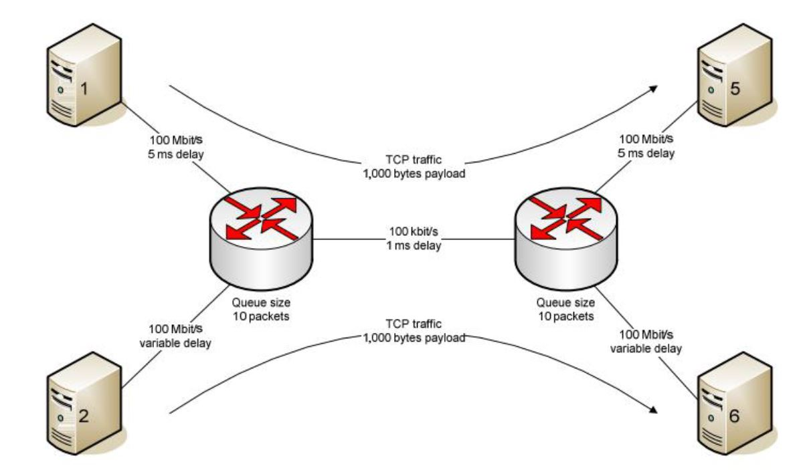

# congestion-control

This is a computer network project using NS2 simulator to perform a congestion control and evaluate some TCP criteria in a given topology.

- TCP New-Renu
- TCP Tahoe
- TCP Vegas

